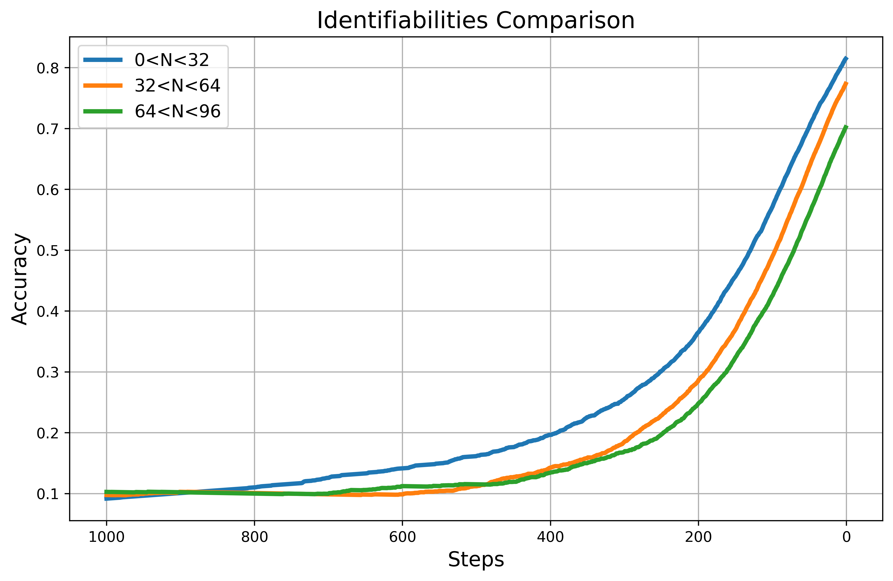
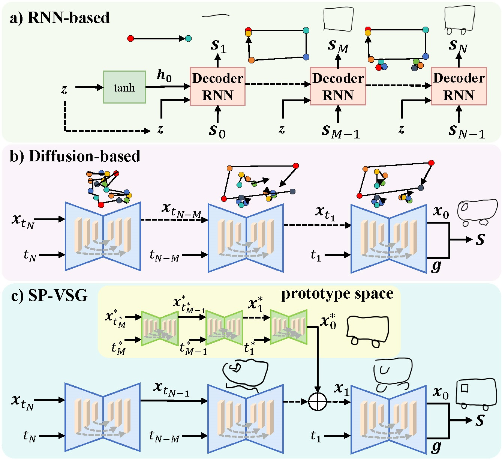

# Self-Prompting Vectorized Sketch Generation with Progressive Diffusion Process(SP-VSG)
  We have publicly released our project code here, and the subsequent content will be continuously improved and updated. Thanks to [OpenAI](https://github.com/openai/guided-diffusion) and [SketchKnitter](https://github.com/wangqiang9/SketchKnitter) for the open-source code
# motivation

  
  
   Forward Diffusion and Reverse Denoising of Vector Sketch.

  Recently, in the field of vector sketch generation, the diffusion model represented by [SketchKnitter](https://github.com/wangqiang9/SketchKnitter) has completely outperformed traditional iterative stroke point generation methods represented by [sketchRNN](https://magenta.tensorflow.org/sketch_rnn) in terms of image quality. Building upon the global modeling of example sketches by SketchKnitter, particularly emphasizing recognizability embedded during the diffusion backward process, and inspired by another contemporaneous work, AdamDiff, we further explored the variations in recognizability during the backward propagation process for sketches of different categories and sketches of the same category but with different stroke point lengths. The results demonstrate that targets with simpler sketch structures exhibit faster improvement in recognizability during the backward process. Based on this observation, we realized that leveraging the differences in recognizability changes during the backward process for sketches with varying structural complexities could enhance the generation of complex vector sketches. This approach resembles an apprentice imitating sketches to improve the quality of their own work. We refer to this as self-guided vector sketch generation.

  
  
   N represents the length of the vector sketch, while Steps denote the time steps in the diffusion model's backward process.

 
# Method

  
  
  Comparison of Different Method Architectures.

  For the task of vector sketch generation, we introduced the DPM-Solver++ high-order solver for sampling vector sketches, building upon the traditional diffusion model for the first time. More importantly, we observed the characteristic of the diffusion model to expedite the formation of well-defined targets during the denoising process for simple sketches. Based on this observation, we further devised a self-guided vector sketch generation algorithm. Multiple-scale samples commence sampling simultaneously, utilizing rapid sampling information in the prototype space of the small scale to guide the fusion of features at specific steps, thereby guiding the generation of larger scale sketches.

# result
  Our method (SP-VSG), at steps=30, surpasses the FID and GS image evaluation metrics compared to full steps of DDIM and the previous state-of-the-art method SketchKnitter.
